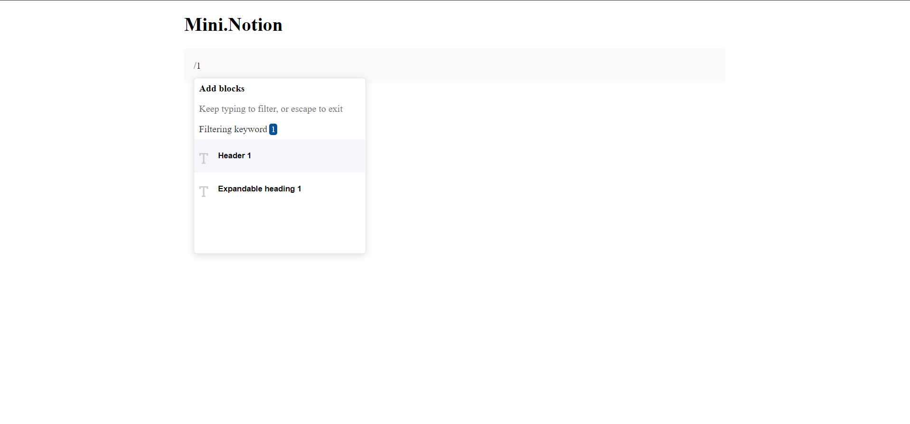

# Mini.Notion

## Table of Contents

* [About the Project](#about-the-project)
* [Built With](#built-with)
* [Getting Started](#getting-started)
* [Contributing](#contributing)
* [Author](#author)
* [Acknowledgements](#acknowledgements)

## About Project

Mini.Notion is a simple, lightweight clone of a Notion-like editor. Default editable block is a paragraph but the app has support for converting the default block to a Heading. Have fun with it!



## [Live Demo](live.demo)

## Built With

* HTML5
* CSS
* Javascript

## Getting Started

* Clone this repo <https://github.com/Lameck1/simple_notion>

    ```bash
    git clone https://github.com/Lameck1/simple_notion.git
    ```

* Navigate to simple_notion folder/directory

    ```bash
    cd simple_notion
    ```

* On the comandline, at the project's root, run ```npm i``` to install app dependencies

* Next, run ```npm run serve``` which will build the project from ```src``` directory and serve into memory

* Go to ```http://localhost:3000/``` to interact with the app

* ALTERNATIVELY

  * Just run ```npm run build``` or ```npx webpack``` which will build the project and generate output files into the ```dist``` directory.

  * Go to ```dist``` directory and manually open ```index.html``` to interact with the app

## Contributing

Contributions, issues, and feature requests are welcome!

Feel free to check the [issues page](https://github.com/Lameck1/simple_notion/issues)

  1. Fork the Project
  2. Create your Feature Branch (`git checkout -b feature/newFeature`)
  3. Commit your Changes (`git commit -m 'Add some newFeature'`)
  4. Push to the Branch (`git push -u origin feature/newFeature`)
  5. Open a Pull Request

## Author

👤 **Lameck Otieno**

* GitHub: [@githubhandle](https://github.com/Lameck1)
* Twitter: [@twitterhandle](https://twitter.com/lameck721)
* LinkedIn: [LinkedIn](https://www.linkedin.com/in/lameck-odhiambo-642b7077/)
* Portfolio: [Portfolio](https://lameck.me)

## Show your support

Give a ⭐️ if you like this project!
